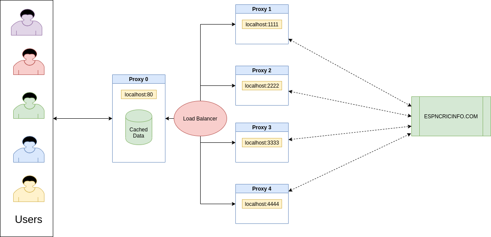

Caching-Proxy-Server
=======================

We hosted a server (Proxy 0) which connects to 4 proxy servers (Proxy 1,2,3,4). The server, Proxy 0 takes requests from the client and forwards these to the list of proxy servers. These 4 proxy servers are load balanced with the round robin algorithm.   

The 4 proxy servers connect to www.espncricinfo.com and cache the response received locally. On subsequent requests, the relevant data is loaded from cache without making another request to espncricinfo.com.    

If there are changes to the website content at espncricinfo.com, the corresponding cache is updated.

Network Structure
==================

Execution Details
==================
We have implimented in the caching server in 2 different approaches.

- Vanilla Nginx 
- Docker Approach

## Vanilla Nginx

In this method we bring up the caching proxy server in our own system.  

- Install Nginx in the server/Computer
- Copy the nginx.conf to the nginx folder on the system (Default Nginx location : /etc/nginx )
- Create a new caching directory called "cache" in the nginx folder (Default location : /etc/nginx/cache )
- Start the nginx server
- Connect to the hosted/loadbalanced/caching proxy server through a browser with a IP : 127.0.0.1:80

## Docker Approch